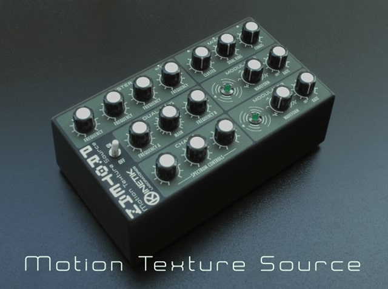

# Protean - Motion Texture Source

In this repository you'll find the schematic and the gerber files to build the **PROTEAN**. It's a compact device that incorporates three independent sound generators for the production of a wide variety of sonic environments with a ever changing expressive vitality.
All sound parameters can be modified through direct manipulation of the knobs allowing a direct, fast and intuitive performance.
The sound generators have complementary timbral characteristic covering all the frequency spectrum and may also be modulated by the two low frequency oscillators implemented in the circuit, generating hypnotic sounds which evolve over time.
Protean has three independent outputs, each with its own output level to allow further manipulation using external effects and may also be used in mono mode when in the needs of a reduced setup.
##### CLUSTER
It’s composed by four frequency controlled oscillators, freely tunable. It allows the creation of eternally sustained chords and clusters of microtonal intervals. This generator provides a sonorous foundation for other sounds.
##### DUAL RING
The signal from the main square oscillator is processed by two ring modulation circuits with the oscillator A in parallel with the oscillator B. The two resultants are added up to generate the final output.
This configuration allows the creation of the typical sounds found in the early experimental electronic music and in the 50’s and 60’s sci-fi movie soundtracks. Careful adjustments of the oscillator pitches result in evocative and constantly changing textures, bell-like or otherwise metallic sounds.
##### CHAOS
It's formed by three oscillators modulating each other and generates similar sounds to those obtainable with cross modulation technique. Its sonic character far exceeds the typical white and pink noise sources. Tuning the oscillator pitches allows timbral metamorphosis and complex variations in tone and sound granularity

##### MODULATOR
The **dual ring** main frequency and the **chaos** oscillator pitches can be automatically modulated using the low frequency oscillators implemented in the *modulator* sections. The wave potentiometer is used to select the **LFO** shape. Six waveforms are available: Random ramp, triangle, sawtooth, reverse sawtooth, square and random pulse. In random ramp mode the oscillator pitches are randomly fluctuating while in random pulse the modulation is by a random amount with a random pulse width. The RATE knob sets the modulation speed, when set in counter clockwise position the modulation is disabled.
##### MIXER
The **mixer** allows volume level adjustments of the three generators. 
